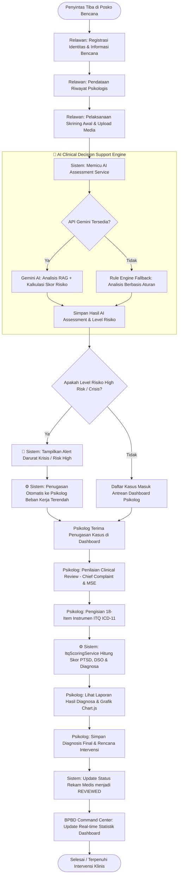
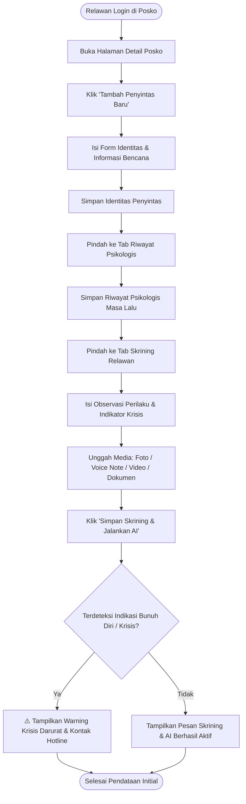
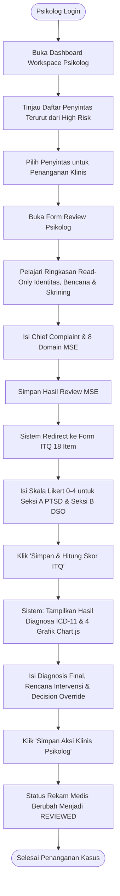
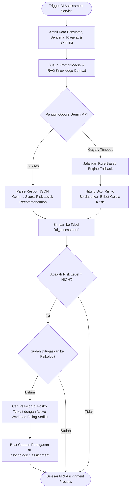

# Dokumen Analisis & Struktur Project PsyAid ITQ

## 📌 Ringkasan Sistem
**PsyAid ITQ** (*Psychological Aid & International Trauma Questionnaire Assessment System*) adalah platform manajemen dan pertolongan pertama kesehatan mental terintegrasi untuk penanganan dampak trauma psikologis korban bencana alam.

Sistem ini dirancang untuk menjembatani koordinasi antara komando bencana daerah (**BPBD**), tenaga garda depan di posko pengungsian (**Relawan Lapangan**), dan profesional kesehatan jiwa (**Psikolog Klinis**) dengan dukungan teknologi **AI Clinical Decision Support (Google Gemini API)** dan instrumen baku **ICD-11 ITQ (International Trauma Questionnaire)**.

---

## 👥 Pengelompokan Berdasarkan Stakeholder Sistem

Below is the structure of the PsyAid ITQ application categorized by system stakeholders, sub-folders, and detailed file descriptions.

```
PsyAid ITQ System
├── 🏢 Stakeholder: BPBD Admin (Command Center)
│   ├── 🖼️ Fitur / Views (app/Views/dashboard/, app/Views/psychologist/)
│   ├── 🎮 Controllers (app/Controllers/)
│   └── 📊 Models & Data (app/Models/)
├── 🤝 Stakeholder: Relawan Lapangan (Field Volunteers)
│   ├── 🖼️ Fitur / Views (app/Views/posko/, app/Views/victim/)
│   ├── 🎮 Controllers (app/Controllers/)
│   └── 📊 Models & Data (app/Models/)
├── 🩺 Stakeholder: Tim Psikolog / Klinisi (Clinical Psychologists)
│   ├── 🖼️ Fitur / Views (app/Views/dashboard/, app/Views/psychologist/, app/Views/itq/)
│   ├── 🎮 Controllers (app/Controllers/)
│   ├── ⚙️ Services / Engines (app/Services/)
│   └── 📊 Models & Data (app/Models/)
└── ⚙️ System Core & Infrastructure (Shared Services, Auth, Database)
    ├── 🔒 Auth & Security Filters (app/Filters/, app/Config/)
    ├── 🧠 AI & RAG Engine Services (app/Services/)
    └── 🗄️ Database Migrations & Seeders (app/Database/)
```

---

### 1. 🏢 Stakeholder: BPBD Admin (Command Center)

#### Peran & Tanggung Jawab:
- Pemantauan makro kondisi psikologis penyintas pasca bencana secara real-time di seluruh wilayah dan posko pengungsian.
- Pengambilan keputusan operasional dan pengalokasian sumber daya berdasarkan indikator tingkat risiko AI (*High Risk Alert*).
- Pemantauan distribusi dan pemetaan beban kerja penugasan psikolog di tiap posko.

#### Sub-Folder & File Detail:

##### 🖼️ Fitur / Views:
* [`app/Views/dashboard/command_center.php`](file:///f:/RAFAEL%20EVAN%20KRISTANTO/LOMBA-LOMBA/PsyAid_ITQ/app/Views/dashboard/command_center.php)
  - **Penjelasan**: Dashboard utama Komando BPBD. Menampilkan KPI statistik makro (Total Penyintas, Ter-skrining, High/Medium/Low Risk, Status Review), filter interaktif berdasarkan Provinsi, Kabupaten, Jenis Bencana, dan Status Posko, serta tabel daftar posko dengan sorotan Posko Prioritas Utama.

##### 🎮 Pengendali / Controllers:
* [`app/Controllers/CommandCenterController.php`](file:///f:/RAFAEL%20EVAN%20KRISTANTO/LOMBA-LOMBA/PsyAid_ITQ/app/Controllers/CommandCenterController.php)
  - **Penjelasan**: Memproses data agregat dashboard BPBD, menyediakan endpoint AJAX `getRegencies()` untuk filter wilayah dinamis, dan `getStats()` untuk kalkulasi ulang statistik serta penetapan prioritas posko tertinggi secara real-time.

##### 📊 Model & Data Terkait:
* [`app/Models/ProvinceModel.php`](file:///f:/RAFAEL%20EVAN%20KRISTANTO/LOMBA-LOMBA/PsyAid_ITQ/app/Models/ProvinceModel.php)
  - **Penjelasan**: Mengakses master data wilayah tingkat Provinsi.
* [`app/Models/RegencyModel.php`](file:///f:/RAFAEL%20EVAN%20KRISTANTO/LOMBA-LOMBA/PsyAid_ITQ/app/Models/RegencyModel.php)
  - **Penjelasan**: Mengakses master data wilayah tingkat Kabupaten/Kota berdasarkan `province_id`.
* [`app/Models/PoskoModel.php`](file:///f:/RAFAEL%20EVAN%20KRISTANTO/LOMBA-LOMBA/PsyAid_ITQ/app/Models/PoskoModel.php)
  - **Penjelasan**: Mengelola data posko pengungsian, lokasi, dan daftar jenis bencana unik.

---

### 2. 🤝 Stakeholder: Relawan Lapangan (Field Volunteers)

#### Peran & Tanggung Jawab:
- Registrasi awal dan pendataan identitas penyintas baru yang masuk ke posko pengungsian.
- Pendataan riwayat dan dampak spesifik trauma bencana (terjebak, kehilangan anggota keluarga, rumah hancur, cedera).
- Pengisian data sensitif riwayat psikologis masa lalu penyintas.
- Pelaksanaan skrining awal observasi perilaku/gejala (SRQ-20 / Indikator Krisis), pengunggahan bukti pendukung (foto, voice note, video, dokumen), dan deteksi awal potensi bahaya krisis/bunuh diri.

#### Sub-Folder & File Detail:

##### 🖼️ Fitur / Views:
* [`app/Views/posko/detail.php`](file:///f:/RAFAEL%20EVAN%20KRISTANTO/LOMBA-LOMBA/PsyAid_ITQ/app/Views/posko/detail.php)
  - **Penjelasan**: Antarmuka Posko Pengungsian bagi relawan. Menampilkan daftar personil yang bertugas, ringkasan statistik posko lokal, serta tabel manajemen penyintas dilengkapi filter pencarian nama/NIK dan status skrining.
* [`app/Views/victim/detail.php`](file:///f:/RAFAEL%20EVAN%20KRISTANTO/LOMBA-LOMBA/PsyAid_ITQ/app/Views/victim/detail.php)
  - **Penjelasan**: Form komprehensif berbasis Tab (1. Identitas, 2. Info Bencana [dilengkapi field *Lokasi Bencana* otomatis berbasis wilayah posko], 3. Riwayat Psikologis, 4. Skrining Relawan, 5. Summary [ringkasan review data korban & tombol quick-edit], 6. AI Assessment) untuk pengelolaan data individu penyintas.

##### 🎮 Pengendali / Controllers:
* [`app/Controllers/RelawanController.php`](file:///f:/RAFAEL%20EVAN%20KRISTANTO/LOMBA-LOMBA/PsyAid_ITQ/app/Controllers/RelawanController.php)
  - **Penjelasan**: Menangani pengarahan (redirect) relawan yang login menuju dashboard posko sesuai tugas poskonya.
* [`app/Controllers/PoskoController.php`](file:///f:/RAFAEL%20EVAN%20KRISTANTO/LOMBA-LOMBA/PsyAid_ITQ/app/Controllers/PoskoController.php)
  - **Penjelasan**: Mengambil detail posko, daftar relawan bertugas, serta menyaring daftar penyintas di posko tersebut.
* [`app/Controllers/VictimController.php`](file:///f:/RAFAEL%20EVAN%20KRISTANTO/LOMBA-LOMBA/PsyAid_ITQ/app/Controllers/VictimController.php)
  - **Penjelasan**: Menangani pembuatan entri penyintas baru (`create()`), pembaruan identitas & dampak bencana (`update()`), serta penyimpanan riwayat kesehatan mental sensitif (`updatePsychologicalHistory()`).
* [`app/Controllers/ScreeningController.php`](file:///f:/RAFAEL%20EVAN%20KRISTANTO/LOMBA-LOMBA/PsyAid_ITQ/app/Controllers/ScreeningController.php)
  - **Penjelasan**: Memproses formulir skrining observasi relawan, penanganan upload berkas media (foto, audio, video, dokumen), pemeriksaan darurat krisis bunuh diri, serta pengaktifan engine AI Assessment.

##### 📊 Model & Data Terkait:
* [`app/Models/VictimModel.php`](file:///f:/RAFAEL%20EVAN%20KRISTANTO/LOMBA-LOMBA/PsyAid_ITQ/app/Models/VictimModel.php)
  - **Penjelasan**: Mengelola data induk penyintas, pencarian per posko, dan penyusunan kueri statistik.
* [`app/Models/DisasterInfoModel.php`](file:///f:/RAFAEL%20EVAN%20KRISTANTO/LOMBA-LOMBA/PsyAid_ITQ/app/Models/DisasterInfoModel.php)
  - **Penjelasan**: Menyimpan data spesifik pengalaman trauma bencana yang dialami penyintas.
* [`app/Models/PsychologicalHistoryModel.php`](file:///f:/RAFAEL%20EVAN%20KRISTANTO/LOMBA-LOMBA/PsyAid_ITQ/app/Models/PsychologicalHistoryModel.php)
  - **Penjelasan**: Menyimpan riwayat konsultasi psikiater, obat-obatan, diagnosis masa lalu, dan indikator risiko melukai diri.
* [`app/Models/VolunteerScreeningModel.php`](file:///f:/RAFAEL%20EVAN%20KRISTANTO/LOMBA-LOMBA/PsyAid_ITQ/app/Models/VolunteerScreeningModel.php)
  - **Penjelasan**: Menyimpan hasil pengamatan kondisi mental penyintas oleh relawan beserta jalur file media pendukung.

---

### 3. 🩺 Stakeholder: Tim Psikolog / Klinisi (Clinical Psychologists)

#### Peran & Tanggung Jawab:
- Menerima penugasan penanganan penyintas (khususnya kasus *High Risk*) yang dialokasikan secara otomatis maupun manual.
- Melakukan pemeriksaan klinis lanjutan: *Chief Complaint* (keluhan utama) dan *Mental Status Examination* (MSE - 8 domain).
- Melakukan asesmen diagnostik menggunakan instrumen baku **18-Item ICD-11 ITQ (International Trauma Questionnaire)**.
- Menegakkan diagnosis kerja (PTSD vs CPTSD vs Normal), meninjau/override rekomendasi AI, menetapkan rencana intervensi klinis, dan menjadwalkan pemantauan berkala (*longitudinal follow-up*).

#### Sub-Folder & File Detail:

##### 🖼️ Fitur / Views:
* [`app/Views/dashboard/psikolog.php`](file:///f:/RAFAEL%20EVAN%20KRISTANTO/LOMBA-LOMBA/PsyAid_ITQ/app/Views/dashboard/psikolog.php)
  - **Penjelasan**: Dashboard Workspace Klinis Psikolog. Menampilkan antrean penyintas yang ditugaskan terurut berdasarkan prioritas risiko (High Risk di urutan teratas) dan status review.
* [`app/Views/psychologist/mapping.php`](file:///f:/RAFAEL%20EVAN%20KRISTANTO/LOMBA-LOMBA/PsyAid_ITQ/app/Views/psychologist/mapping.php)
  - **Penjelasan**: Antarmuka pemetaan beban kerja psikolog di setiap posko (total penugasan & kasus aktif belum direview).
* [`app/Views/psychologist/review.php`](file:///f:/RAFAEL%20EVAN%20KRISTANTO/LOMBA-LOMBA/PsyAid_ITQ/app/Views/psychologist/review.php)
  - **Penjelasan**: Lembar kerja peninjauan klinis psikolog. Menampilkan ringkasan *read-only* data penyintas & skrining relawan, serta formulir input Chief Complaint dan 8 domain MSE.
* [`app/Views/itq/form.php`](file:///f:/RAFAEL%20EVAN%20KRISTANTO/LOMBA-LOMBA/PsyAid_ITQ/app/Views/itq/form.php)
  - **Penjelasan**: Formulir pengisian instrumen resmi 18-item ITQ ICD-11 (skala Likert 0-4) yang terbagi atas Seksi A (PTSD) dan Seksi B (DSO).
* [`app/Views/itq/result.php`](file:///f:/RAFAEL%20EVAN%20KRISTANTO/LOMBA-LOMBA/PsyAid_ITQ/app/Views/itq/result.php)
  - **Penjelasan**: Laporan hasil skor ITQ, diagnosis ICD-11 otomatis, visualisasi 4 grafik interaktif (Chart.js), dan formulir penetapan Aksi & Decision Support Klinis.

##### 🎮 Pengendali / Controllers:
* [`app/Controllers/PsikologController.php`](file:///f:/RAFAEL%20EVAN%20KRISTANTO/LOMBA-LOMBA/PsyAid_ITQ/app/Controllers/PsikologController.php)
  - **Penjelasan**: Menyajikan workspace antrean tugas psikolog berdasarkan prioritas kasus.
* [`app/Controllers/PsychologistMappingController.php`](file:///f:/RAFAEL%20EVAN%20KRISTANTO/LOMBA-LOMBA/PsyAid_ITQ/app/Controllers/PsychologistMappingController.php)
  - **Penjelasan**: Menghitung beban kerja psikolog di tiap posko untuk pemantauan alokasi SDM.
* [`app/Controllers/PsychologistReviewController.php`](file:///f:/RAFAEL%20EVAN%20KRISTANTO/LOMBA-LOMBA/PsyAid_ITQ/app/Controllers/PsychologistReviewController.php)
  - **Penjelasan**: Menampilkan data histori penyintas dan mengumpulkan input pemeriksaan MSE psikolog.
* [`app/Controllers/ItqController.php`](file:///f:/RAFAEL%20EVAN%20KRISTANTO/LOMBA-LOMBA/PsyAid_ITQ/app/Controllers/ItqController.php)
  - **Penjelasan**: Mengelola pengisian form ITQ, memicu kalkulasi scoring engine, menyajikan laporan hasil, dan memberikan data JSON untuk grafik Chart.js (`getChartData()`).
* [`app/Controllers/ClinicalActionController.php`](file:///f:/RAFAEL%20EVAN%20KRISTANTO/LOMBA-LOMBA/PsyAid_ITQ/app/Controllers/ClinicalActionController.php)
  - **Penjelasan**: Menyimpan keputusan diagnosis final, status persetujuan/override AI, rencana intervensi, serta mengubah status rekam medis penyintas menjadi `REVIEWED`.

##### ⚙️ Services / Layanan Diagnostik:
* [`app/Services/ItqScoringService.php`](file:///f:/RAFAEL%20EVAN%20KRISTANTO/LOMBA-LOMBA/PsyAid_ITQ/app/Services/ItqScoringService.php)
  - **Penjelasan**: Algoritma kalkulasi skor 18 item ITQ. Menghitung skor total PTSD & DSO, memeriksa ambang batas item (Likert ≥ 2), mengevaluasi gangguan fungsi (Impairment), dan menentukan klasifikasi diagnostik ICD-11 (**CPTSD**, **PTSD**, atau **No PTSD/DSO**).
* [`app/Services/PsychologistAssignmentService.php`](file:///f:/RAFAEL%20EVAN%20KRISTANTO/LOMBA-LOMBA/PsyAid_ITQ/app/Services/PsychologistAssignmentService.php)
  - **Penjelasan**: Algoritma penugasan otomatis psikolog (*Auto-Matching Engine*). Memilih psikolog terbaik di posko terkait yang memiliki beban kerja (*active workload*) paling sedikit untuk menangani penyintas berisiko tinggi.

##### 📊 Model & Data Terkait:
* [`app/Models/PsychologistAssignmentModel.php`](file:///f:/RAFAEL%20EVAN%20KRISTANTO/LOMBA-LOMBA/PsyAid_ITQ/app/Models/PsychologistAssignmentModel.php)
  - **Penjelasan**: Menyimpan tabel relasi penugasan antara psikolog dan penyintas.
* [`app/Models/PsychologistReviewModel.php`](file:///f:/RAFAEL%20EVAN%20KRISTANTO/LOMBA-LOMBA/PsyAid_ITQ/app/Models/PsychologistReviewModel.php)
  - **Penjelasan**: Menyimpan catatan pemeriksaan klinis *Chief Complaint* dan 8 domain MSE.
* [`app/Models/ItqAnswersModel.php`](file:///f:/RAFAEL%20EVAN%20KRISTANTO/LOMBA-LOMBA/PsyAid_ITQ/app/Models/ItqAnswersModel.php)
  - **Penjelasan**: Menyimpan jawaban mentah item 1-18 instrumen ITQ.
* [`app/Models/ItqResultModel.php`](file:///f:/RAFAEL%20EVAN%20KRISTANTO/LOMBA-LOMBA/PsyAid_ITQ/app/Models/ItqResultModel.php)
  - **Penjelasan**: Menyimpan hasil olahan skor PTSD, skor DSO, dan label diagnosis ICD-11.
* [`app/Models/LongitudinalFollowupModel.php`](file:///f:/RAFAEL%20EVAN%20KRISTANTO/LOMBA-LOMBA/PsyAid_ITQ/app/Models/LongitudinalFollowupModel.php)
  - **Penjelasan**: Menyimpan histori perkembangan skor trauma dari waktu ke waktu untuk grafik tren pemulihan.
* [`app/Models/ClinicalActionModel.php`](file:///f:/RAFAEL%20EVAN%20KRISTANTO/LOMBA-LOMBA/PsyAid_ITQ/app/Models/ClinicalActionModel.php)
  - **Penjelasan**: Menyimpan keputusan klinis akhir psikolog, rencana intervensi, dan jadwal *follow-up*.

---

### 4. ⚙️ Layanan Inti Sistem & AI Core Engine (System Shared Components)

#### Sub-Folder & File Detail:

##### 🔒 Auth, Security & Config:
* [`app/Config/Routes.php`](file:///f:/RAFAEL%20EVAN%20KRISTANTO/LOMBA-LOMBA/PsyAid_ITQ/app/Config/Routes.php)
  - **Penjelasan**: Pengaturan rute URL sistem dan pendaftaran filter autentikasi/otorisasi hak akses per role.
* [`app/Controllers/AuthController.php`](file:///f:/RAFAEL%20EVAN%20KRISTANTO/LOMBA-LOMBA/PsyAid_ITQ/app/Controllers/AuthController.php)
  - **Penjelasan**: Menangani proses masuk (login), pengakhiran sesi (logout), pembatasan akses (403 forbidden), dan pengarahan otomatis sesuai hak akses peran (`bpbd_admin`, `relawan`, `psikolog`).
* [`app/Filters/AuthFilter.php`](file:///f:/RAFAEL%20EVAN%20KRISTANTO/LOMBA-LOMBA/PsyAid_ITQ/app/Filters/AuthFilter.php)
  - **Penjelasan**: Middleware proteksi untuk memastikan pengguna telah login sebelum mengakses halaman internal.
* [`app/Filters/RoleFilter.php`](file:///f:/RAFAEL%20EVAN%20KRISTANTO/LOMBA-LOMBA/PsyAid_ITQ/app/Filters/RoleFilter.php)
  - **Penjelasan**: Middleware verifikasi peran (*RBAC - Role-Based Access Control*) untuk memastikan user hanya dapat mengakses fitur yang diizinkan untuk rolenya.
* [`app/Views/layouts/main.php`](file:///f:/RAFAEL%20EVAN%20KRISTANTO/LOMBA-LOMBA/PsyAid_ITQ/app/Views/layouts/main.php)
  - **Penjelasan**: Master layout HTML5 aplikasi yang memuat navbar dinamis sesuai peran pengguna, alert flashdata, modal bantuan, dan footer.

##### 🧠 AI & RAG Knowledge Services:
* [`app/Services/AiAssessmentService.php`](file:///f:/RAFAEL%20EVAN%20KRISTANTO/LOMBA-LOMBA/PsyAid_ITQ/app/Services/AiAssessmentService.php)
  - **Penjelasan**: Engine Clinical Decision Support berbasis AI. Mengintegrasikan API Google Gemini (dengan fallback *Rule Engine*), menghitung skor risiko trauma (0-100), menentukan `risk_level` (High/Medium/Low), mendeteksi indikator krisis/bunuh diri, merumuskan pertimbangan klinis, serta secara otomatis memicu penugasan psikolog jika berisiko tinggi.
* [`app/Services/ClinicalRagKnowledgeService.php`](file:///f:/RAFAEL%20EVAN%20KRISTANTO/LOMBA-LOMBA/PsyAid_ITQ/app/Services/ClinicalRagKnowledgeService.php)
  - **Penjelasan**: Basis pengetahuan RAG (*Retrieval-Augmented Generation*) yang menyediakan pedoman medis trauma pasca bencana, pertolongan pertama psikologis (PFA), dan kriteria diagnostik ICD-11 sebagai konteks bagi AI Gemini.
* [`app/Models/AiAssessmentModel.php`](file:///f:/RAFAEL%20EVAN%20KRISTANTO/LOMBA-LOMBA/PsyAid_ITQ/app/Models/AiAssessmentModel.php)
  - **Penjelasan**: Menyimpan data hasil penilaian risiko AI, ringkasan analisis, dan status review.

##### 🗄️ Master Models & Database Migrations:
* [`app/Models/UserModel.php`](file:///f:/RAFAEL%20EVAN%20KRISTANTO/LOMBA-LOMBA/PsyAid_ITQ/app/Models/UserModel.php)
  - **Penjelasan**: Mengelola data kredensial pengguna, peran, dan posko tempat bertugas.
* [`app/Database/Migrations/`](file:///f:/RAFAEL%20EVAN%20KRISTANTO/LOMBA-LOMBA/PsyAid_ITQ/app/Database/Migrations/)
  - **Penjelasan**: Berisi 13 berkas skema struktur tabel basis data MySQL (Wilayah, Users, Victims, DisasterInfo, PsychologicalHistory, VolunteerScreening, AiAssessment, PsychologistAssignment, PsychologistReview, ItqAnswers, ItqResult, LongitudinalFollowup, ClinicalAction).
* [`app/Database/Seeds/`](file:///f:/RAFAEL%20EVAN%20KRISTANTO/LOMBA-LOMBA/PsyAid_ITQ/app/Database/Seeds/)
  - **Penjelasan**: Berisi berkas data awal (seeders) untuk menginstal data master wilayah, posko, akun pengguna per role, dan data uji coba penyintas.

---

## 🔄 Activity Diagrams (Diagram Alur Kerja Sistem)

Berikut adalah diagram alur aktivitas (*Activity Diagrams*) yang menggambarkan proses kerja di dalam sistem PsyAid ITQ.

### 1. Activity Diagram Utama: End-to-End System Workflow
Diagram ini menggambarkan alur lengkap sejak penyintas tiba di posko bencana hingga penetapan aksi klinis oleh psikolog.



---

### 2. Activity Diagram Stakeholder: BPBD Admin Command Center
Diagram alur kerja BPBD Admin dalam memantau dan mengambil keputusan operasional.

```mermaid
flowchart TD
    StartBPBD([BPBD Admin Login]) --> ShowDashboard[Sistem: Tampilkan Dashboard Command Center]
    ShowDashboard --> ViewStats[Tinjau KPI Statistik Makro & Peta Posko]
    ViewStats --> FilterInput{Ingin Menyaring Data?}
    
    FilterInput -- Ya --> SelectFilter[Pilih Filter: Provinsi / Kabupaten / Bencana / Status]
    SelectFilter --> AJAXReq[Kirim AJAX Request getStats()]
    AJAXReq --> UpdateDOM[Sistem: Perbarui Statistik & Highlight Posko Prioritas Utama]
    UpdateDOM --> ViewDetailPosko[Pilih Detail Posko / Penyintas High Risk]
    
    FilterInput -- Tidak --> ViewDetailPosko
    ViewDetailPosko --> MonitorMapping[Buka Halaman Mapping Penugasan Psikolog]
    MonitorMapping --> EvaluateWorkload[Evaluasi Beban Kerja & Retensi Kasus per Posko]
    EvaluateWorkload --> BPBDEnd([Selesai Memantau Command Center])
```

---

### 3. Activity Diagram Stakeholder: Relawan Lapangan
Diagram alur kerja relawan di posko pengungsian.



---

### 4. Activity Diagram Stakeholder: Tim Psikolog / Klinisi
Diagram alur kerja penanganan klinis, asesmen ITQ, dan penetapan aksi oleh psikolog.



---

### 5. Activity Diagram Engine: AI Risk Engine & Automatic Assignment
Diagram alur kalkulasi cerdas AI dan algoritma penugasan otomatis psikolog.



---

## 📌 Kesimpulan
Struktur project **PsyAid ITQ** memadukan arsitektur MVC (Model-View-Controller) khas CodeIgniter 4 dengan pemisahan peran (*role-based separation of concerns*) yang jelas untuk **BPBD Admin**, **Relawan Lapangan**, dan **Psikolog Klinis**. Didukung oleh **AI Assessment Engine** dan **ITQ Diagnostic Scoring**, sistem ini menjamin respon cepat, akurat, dan terukur dalam pertolongan psikologis korban bencana.
