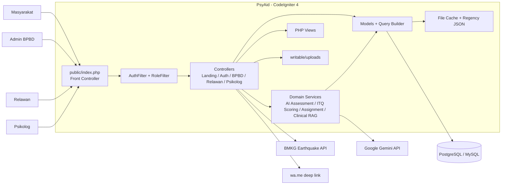
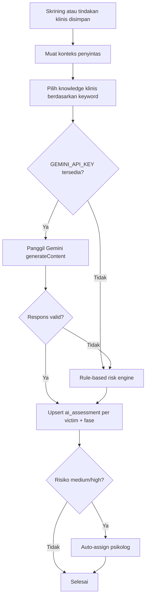
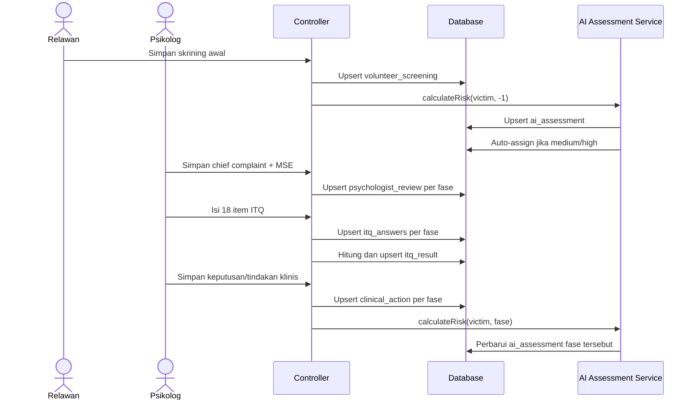
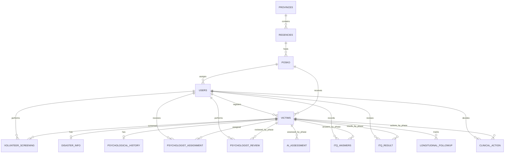

# Arsitektur Backend PsyAid

Dokumen ini menjelaskan arsitektur backend PsyAid berdasarkan implementasi pada kode sumber per 2 Agustus 2026. Fokus dokumen adalah kondisi sistem saat ini (*as-is*), bukan rancangan ideal yang belum diimplementasikan.

## 1. Ringkasan sistem

PsyAid adalah aplikasi web monolitik berbasis CodeIgniter 4 untuk pengelolaan penyintas bencana dan dukungan keputusan klinis psikologis. Backend melayani halaman HTML yang dirender di server dan beberapa endpoint JSON. Tiga kelompok pengguna internal adalah:

- `bpbd_admin`: mengelola posko, personel, laporan masyarakat, pemetaan psikolog, dan command center.
- `relawan`: mendaftarkan penyintas dan melakukan skrining awal.
- `psikolog`: melakukan review klinis, mengisi ITQ, menetapkan tindakan klinis, dan memonitor tindak lanjut.

Selain itu, masyarakat dapat mengirim laporan bencana dan permohonan menjadi relawan melalui endpoint publik.

Karakteristik teknis utama:

| Area | Implementasi |
|---|---|
| Runtime | PHP 8.2 |
| Framework | CodeIgniter 4.7 |
| Gaya aplikasi | Monolitik MVC, server-side rendered |
| Persistensi | PostgreSQL atau MySQL melalui CodeIgniter Query Builder/Model |
| Autentikasi | Session berbasis file, password hash PHP |
| Otorisasi | Filter route berbasis peran |
| AI | Google Gemini API dengan fallback rule-based |
| Knowledge retrieval | Knowledge base klinis statis berbasis keyword di dalam aplikasi |
| Cache | File cache; data kabupaten/kota juga dapat dibaca dari JSON statis |
| Penyimpanan berkas | `writable/uploads` pada filesystem lokal/volume |
| Deployment utama | Container Apache + PHP; mendukung Railway/Supabase |
| Progressive Web App | Manifest + service worker dengan fallback offline tanpa cache data klinis |

## 2. Konteks dan komponen utama



### Batas sistem

- Backend dan frontend berada dalam satu codebase. Controller mengembalikan PHP view atau JSON.
- Tidak ada REST API terpisah, message broker, worker asinkron, atau microservice.
- Pemanggilan AI dan BMKG berlangsung sinkron di dalam lifecycle HTTP request.
- Penilaian AI adalah dukungan keputusan. Keputusan klinis akhir tetap disimpan oleh psikolog.

## 3. Struktur kode backend

```text
app/
├── Config/                 Konfigurasi route, database, filter, session, cache, dan keamanan
├── Controllers/
│   ├── Auth/               Login, logout, dan registrasi admin BPBD
│   ├── Bpbd/               Command center dan administrasi operasional
│   ├── Relawan/            Data penyintas dan skrining awal
│   └── Psikolog/           Review klinis, ITQ, tindakan, dan monitoring
├── Database/
│   ├── Migrations/         Definisi dan evolusi skema
│   └── Seeds/              Data awal/demonstrasi
├── Filters/                Pemeriksaan autentikasi dan peran
├── Models/                 Akses tabel dan query agregasi
├── Services/               Logika domain lintas-controller
└── Views/                  Template HTML yang dirender server

public/                     Document root dan aset publik
writable/                   Session, cache, log, dan upload runtime
tests/                      PHPUnit dan test support
```

Alur request umum:

1. Apache meneruskan request ke `public/index.php`.
2. Router mencocokkan method dan path yang didefinisikan eksplisit di `app/Config/Routes.php`; auto-routing dinonaktifkan.
3. `AuthFilter` memastikan session `logged_in` tersedia pada route terproteksi.
4. `RoleFilter` membandingkan role session dengan argumen filter route.
5. Controller memvalidasi input, memanggil model atau domain service, lalu mengembalikan redirect, view, atau JSON.
6. Model/Query Builder berkomunikasi dengan database. Service dapat memanggil Gemini atau service internal lain secara sinkron.

## 4. Modul backend

### 4.1 Autentikasi dan otorisasi

`AuthController` menangani registrasi, login, logout, dan halaman forbidden.

- Password disimpan dengan `password_hash(..., PASSWORD_DEFAULT)` dan diverifikasi dengan `password_verify`.
- Session menyimpan `user_id`, `user_name`, `name`, `email`, `role`, `posko_id`, dan `logged_in`.
- Session menggunakan `FileHandler`, disimpan di `writable/session`, berlaku 7.200 detik, dan ID diregenerasi setiap 300 detik.
- Pengguna diarahkan ke workspace berdasarkan role setelah login.
- `AuthFilter` hanya memeriksa status login; `RoleFilter` memeriksa role yang diizinkan oleh route.

Otorisasi yang tersedia adalah role-level access control. Pemeriksaan kepemilikan objek, misalnya memastikan psikolog hanya membuka penyintas yang ditugaskan kepadanya, belum diterapkan secara konsisten di controller.

### 4.2 Landing dan intake publik

`LandingController` menangani:

- halaman landing;
- daftar kebutuhan rekrutmen per posko;
- permohonan relawan publik ke `volunteer_registrations`;
- laporan bencana masyarakat ke `disaster_reports` dengan kode tiket unik.

Admin BPBD memproses permohonan relawan dan dapat membuat akun relawan. Hasil approve/reject menghasilkan URL `wa.me` untuk membuka pesan WhatsApp; backend tidak mengirim pesan melalui WhatsApp API.

### 4.3 Operasional BPBD

Controller di namespace `Bpbd` menyediakan:

- dashboard dan statistik agregat penyintas/personel;
- command center dengan filter posko, wilayah, jenis bencana, dan status;
- CRUD posko;
- registrasi relawan dan psikolog;
- pemetaan psikolog ke posko;
- ticketing laporan masyarakat;
- radar gempa melalui proxy data BMKG.

Statistik command center dihitung oleh query agregasi di `VictimModel`. Pemetaan psikolog mengubah `users.posko_id`.

### 4.4 Registrasi penyintas dan skrining relawan

`VictimController` menyimpan tiga kelompok data:

- identitas dan kedatangan penyintas pada `victims`;
- paparan bencana pada `disaster_info`;
- riwayat psikologis pada `psychological_history`.

`ScreeningController` menyimpan observasi awal pada `volunteer_screening`. Lampiran opsional yang didukung adalah gambar, audio, video, dan dokumen, dengan batas ukuran dan ekstensi yang divalidasi sebelum disimpan di `writable/uploads/victim_{id}`.

Setelah skrining disimpan, backend menjalankan `AiAssessmentService` untuk fase `-1`. Indikasi bunuh diri atau melukai diri memicu peringatan krisis pada UI, sementara data asesmen tetap disimpan.

### 4.5 AI Clinical Decision Support

`AiAssessmentService` memuat konteks berikut untuk proses asesmen:

- identitas penyintas;
- skrining relawan;
- paparan bencana;
- riwayat psikologis;
- hasil ITQ pada fase terkait;
- review MSE dan tindakan klinis pada fase terkait;
- pedoman yang dipilih oleh `ClinicalRagKnowledgeService`.



Implementasi RAG saat ini bukan vector search atau retrieval dari dokumen eksternal. `ClinicalRagKnowledgeService` berisi knowledge base statis dan memilih pedoman berdasarkan indikator klinis. Kategori yang tersedia meliputi protokol krisis bunuh diri, ICD-11 PTSD/CPTSD, WHO PFA untuk panik, dukungan duka IASC, dan dukungan anak/kelompok rentan.

Jika `GEMINI_API_KEY` tersedia, service memanggil endpoint `generateContent` dengan model dari `GEMINI_MODEL` dan Google Search grounding. Jika key tidak tersedia, request gagal, atau respons tidak dapat dipakai, sistem beralih ke rule-based engine. Hasil disimpan pada `ai_assessment`, termasuk tingkat risiko, confidence, prioritas klinis, kemungkinan diagnosis, bukti, ringkasan, status, dan fase.

Jalur Gemini menerima konteks MSE dan tindakan klinis fase terkait. Pada implementasi saat ini, fallback rule-based terutama menghitung risiko dari identitas, skrining, paparan bencana, riwayat psikologis, hasil ITQ, dan knowledge yang terpilih.

### 4.6 Penugasan psikolog

`PsychologistAssignmentService` otomatis berjalan untuk risiko `medium` atau `high`.

1. Cari psikolog pada posko penyintas.
2. Jika tidak ada, gunakan seluruh psikolog yang tersedia sebagai fallback.
3. Hitung beban aktif berdasarkan assignment yang belum memiliki psychologist review.
4. Pilih psikolog dengan beban terendah.
5. Insert atau update `psychologist_assignment` untuk penyintas tersebut.

Pemilihan dan penyimpanan belum dibungkus transaksi atau lock, sehingga assignment serentak berpotensi memilih psikolog yang sama berdasarkan snapshot beban yang sama.

### 4.7 Review psikolog, ITQ, dan tindakan klinis

Alur klinis utama:



`ItqScoringService` menerima 18 jawaban bernilai 0–4:

- item 1–6: skor gejala PTSD;
- item 7–9: gangguan fungsi PTSD;
- item 10–15: skor DSO;
- item 16–18: gangguan fungsi DSO.

Kriteria PTSD dan DSO ditentukan per klaster dengan ambang item `>= 2` dan adanya gangguan fungsi. Diagnosis akhir adalah `Complex PTSD (CPTSD)`, `PTSD`, atau `No PTSD/CPTSD`. Pemetaan severity dan percentile di kode adalah pendekatan lokal untuk prototipe, bukan norma klinis resmi; hasilnya harus ditinjau profesional.

`ClinicalActionController` menyimpan persetujuan/override rekomendasi AI, diagnosis sementara, intervensi, catatan klinis, jadwal follow-up, dan status review. Setelah tindakan tersimpan, AI dihitung ulang dengan konteks fase tersebut.

### 4.8 Monitoring longitudinal

Monitoring menampilkan progres per fase untuk penyintas yang ditugaskan kepada psikolog. Query menggunakan window function `ROW_NUMBER()` untuk memilih record terbaru dan mencegah perkalian baris antarhasil ITQ dan tindakan klinis.

Konvensi fase yang digunakan:

| Nilai `fase_ke` | Makna |
|---:|---|
| `-1` | Asesmen AI setelah skrining awal relawan |
| `0` | Asesmen klinis awal psikolog |
| `1..n` | Siklus follow-up berikutnya |
| `99` | Keputusan akhir pada `clinical_action` |

Ringkasan follow-up dapat dihasilkan oleh Gemini. Jika Gemini tidak tersedia, service mempunyai ringkasan berbasis aturan. Data time-series lama juga dimodelkan melalui `longitudinal_followup`.

## 5. Model data



Tabel domain:

| Tabel | Fungsi dan relasi penting |
|---|---|
| `provinces` | Referensi provinsi. |
| `regencies` | Kabupaten/kota; FK ke `provinces`; memiliki indeks gabungan `(province_id, name)`. |
| `posko` | Posko bencana; FK ke `regencies`; menyimpan status dan kebutuhan rekrutmen. |
| `users` | Akun internal dan role; FK opsional ke `posko`. |
| `victims` | Data identitas penyintas; FK ke `posko` dan relawan penemu. |
| `disaster_info` | Paparan bencana per penyintas. |
| `psychological_history` | Riwayat psikologis/psikiatris dan faktor risiko. |
| `volunteer_screening` | Observasi skrining awal, indikator krisis, dan path lampiran. |
| `ai_assessment` | Hasil dukungan keputusan AI/rule engine per penyintas dan fase. |
| `psychologist_assignment` | Penugasan penyintas ke psikolog dan snapshot beban saat assignment. |
| `psychologist_review` | Chief complaint, MSE, dan risk assessment per fase. |
| `itq_answers` | Jawaban 18 item ITQ per fase. |
| `itq_result` | Skor PTSD/DSO, severity, percentile, kriteria, dan diagnosis akhir per fase. |
| `clinical_action` | Keputusan/tindakan psikolog per fase; fase `99` dipakai sebagai keputusan akhir. |
| `longitudinal_followup` | Data time-series hari, skor PTSD/DSO, dan catatan psikolog. |
| `volunteer_registrations` | Permohonan relawan publik dan status approval. |
| `disaster_reports` | Laporan masyarakat dengan `ticket_code` unik dan status ticketing. |

Mayoritas relasi klinis menggunakan `ON DELETE CASCADE`. Relasi user/posko tertentu menggunakan `SET NULL`. Pola satu record per `(victim_id, fase_ke)` dijaga melalui logika *find-then-update* di aplikasi, tetapi belum dilindungi unique constraint database.

## 6. Katalog endpoint

### Publik dan autentikasi

| Method | Path | Fungsi |
|---|---|---|
| GET | `/`, `/landing` | Landing page |
| GET | `/rekrutmen-relawan` | Daftar rekrutmen relawan |
| POST | `/api/register-volunteer-request` | Kirim permohonan relawan |
| GET | `/laporan-masyarakat` | Form laporan masyarakat |
| POST | `/api/store-disaster-report` | Buat tiket laporan bencana |
| GET/POST | `/login` | Form/proses login |
| GET/POST | `/register` | Form/proses registrasi admin BPBD |
| GET | `/logout` | Hapus session |
| GET | `/health/database` | Health check koneksi database |

### BPBD admin

| Method | Path utama | Fungsi |
|---|---|---|
| GET | `/bpbd/dashboard` | Dashboard BPBD |
| GET | `/command-center` | Command center |
| GET | `/command-center/get-stats` | Statistik JSON |
| GET | `/command-center/get-regencies/{provinceId}` | Kabupaten/kota JSON |
| GET | `/bpbd/earthquake-radar` | Halaman radar gempa |
| GET | `/api/earthquake-data` | Proxy data BMKG; membutuhkan login |
| GET/POST | `/bpbd/manage-posko/*` | Daftar, lookup wilayah, tambah, ubah, hapus posko |
| GET/POST | `/bpbd/register-relawan` | Daftar/tambah permohonan relawan |
| POST | `/bpbd/approval-relawan/{approve|reject}/{id}` | Proses approval relawan |
| GET/POST | `/bpbd/register-psikolog` | Daftar/tambah psikolog |
| GET/POST | `/bpbd/psychologist-mapping/*` | Pemetaan psikolog ke posko |
| GET/POST | `/bpbd/ticketing-laporan/*` | Daftar, ubah status, dan hapus laporan |

### Relawan dan data penyintas

| Method | Path utama | Fungsi |
|---|---|---|
| GET | `/relawan/posko/{id}` | Workspace posko relawan |
| GET | `/relawan/manajemen-penyintas` | Manajemen penyintas |
| GET/POST | `/victim/create/{poskoId}`, `/victim/store/{poskoId}` | Registrasi penyintas |
| GET | `/victim/detail/{id}` | Detail penyintas |
| GET | `/victim/detail-json/{id}` | Detail penyintas JSON |
| POST | `/victim/update/{id}` | Ubah identitas/paparan bencana |
| POST | `/victim/update-psychological/{id}` | Ubah riwayat psikologis |
| POST | `/screening/store/{victimId}` | Simpan skrining dan jalankan AI |
| GET/POST | `/screening/reassess/{victimId}` | Jalankan ulang asesmen AI |

### Psikolog

| Method | Path utama | Fungsi |
|---|---|---|
| GET | `/psikolog/dashboard` | Daftar assignment psikolog |
| GET | `/psikolog/assessment-history*` | Riwayat asesmen |
| GET/POST | `/psychologist-review/*` | Form dan penyimpanan MSE |
| GET/POST | `/itq/form/*`, `/itq/store/*` | Form dan penyimpanan ITQ |
| GET | `/itq/result/{victimId}` | Hasil scoring ITQ |
| GET | `/itq/chart-data/{victimId}` | Data grafik ITQ/follow-up JSON |
| POST | `/clinical-action/save/{victimId}` | Simpan tindakan klinis |
| GET | `/psikolog/monitoring` | Daftar monitoring |
| GET | `/psikolog/monitoring/detail/{victimId}` | Detail monitoring per fase |
| GET | `/psikolog/monitoring/generate-ai-summary/{victimId}` | Buat ringkasan AI |
| POST | `/psikolog/monitoring/store-final-decision/{victimId}` | Simpan keputusan akhir |
| POST | `/psikolog/monitoring/update-ai-summary/{victimId}/{fase}` | Koreksi ringkasan AI |

Parameter `fase_ke` untuk review, ITQ, hasil, dan tindakan klinis dikirim sebagai query string, misalnya `?fase_ke=1`.

## 7. Integrasi eksternal dan kegagalan

### Google Gemini

- Endpoint: Google Generative Language API `generateContent`.
- Konfigurasi: `GEMINI_API_KEY` dan `GEMINI_MODEL`.
- Timeout: 15 detik.
- Kegagalan HTTP, exception, respons kosong, atau format yang tidak valid dicatat ke log dan dialihkan ke rule-based engine.
- Pemanggilan bersifat sinkron sehingga latensi Gemini menambah latensi request pengguna.

### BMKG

- Sumber: `https://data.bmkg.go.id/DataMKG/TEWS/gempadirasakan.json`.
- Backend bertindak sebagai proxy dan menormalisasi data untuk UI radar.
- Error upstream menghasilkan respons JSON `502` atau `500` dan dicatat ke log.

### WhatsApp

- Integrasi hanya menghasilkan deep link `https://wa.me/...` pada alur approval relawan.
- Tidak ada webhook, credential, delivery receipt, atau pengiriman server-to-server.

### Cache dan data wilayah

- Handler cache default adalah file di `writable/cache`, dengan prefix `psyaid_`.
- `ProvinceModel` menyimpan daftar provinsi selama 24 jam melalui cache service.
- `RegencyModel` mengutamakan `public/data/regencies_grouped.json`, lalu fallback ke query database.

## 8. Konfigurasi dan deployment

### Variabel environment

| Variabel | Keterangan |
|---|---|
| `CI_ENVIRONMENT` | Mode CodeIgniter, misalnya `development` atau `production`. |
| `app.baseURL` | URL dasar aplikasi. |
| `DATABASE_URL` / `DATABASE_PUBLIC_URL` | URL koneksi database yang diparsing otomatis. |
| `PGHOST`, `PGDATABASE`, `PGUSER`, `PGPASSWORD`, `PGPORT` | Konfigurasi PostgreSQL/Railway. |
| `MYSQLHOST`, `MYSQLDATABASE`, `MYSQLUSER`, `MYSQLPASSWORD`, `MYSQLPORT` | Konfigurasi MySQL/Railway. |
| `database.default.*` | Override standar CodeIgniter untuk koneksi database. |
| `GEMINI_API_KEY` | API key Gemini; kosong berarti rule-based only. |
| `GEMINI_MODEL` | Model Gemini, default di kode `gemini-1.5-flash`. |
| `PORT` | Port Apache di container, default `8080`. |

`Database.php` memilih MySQL jika URL/host/driver MySQL terdeteksi; selain itu menggunakan PostgreSQL. Konfigurasi tidak lengkap menyebabkan startup database melempar `RuntimeException`. Environment test menggunakan SQLite in-memory.

### Container

Image aplikasi dibangun dari `php:8.2-apache`, memasang ekstensi MySQL dan PostgreSQL, mengarahkan Apache document root ke `public`, serta menjalankan `composer install --no-dev`. Entrypoint menyesuaikan port Railway dan menyiapkan direktori `writable`.

`docker-compose.yml` menyediakan aplikasi dan MySQL 8 untuk pengembangan lokal. Volume `writable` mempertahankan session/cache/upload aplikasi, sedangkan `db_data` mempertahankan database.

### Inisialisasi umum

```bash
composer install
php spark migrate --all
php spark db:seed DatabaseSeeder
php spark serve
```

Untuk container lokal:

```bash
docker compose up --build
```

Gunakan nilai rahasia melalui environment deployment dan jangan commit file `.env` produksi.

## 9. Keamanan, privasi, dan observability

### Kontrol yang sudah ada

- route eksplisit dengan auto-routing nonaktif;
- password hashing menggunakan API bawaan PHP;
- autentikasi dan role filter pada workspace internal;
- validasi input pada form utama;
- pembatasan tipe dan ukuran upload skrining;
- HTTPS filter dipasang sebagai required filter;
- log CodeIgniter untuk error Gemini dan BMKG.

### Karakter data

Database dan upload memuat PII serta data kesehatan mental yang sensitif: NIK, kontak keluarga, riwayat psikologis, indikator bunuh diri, catatan klinis, dan media penyintas. Pada deployment produksi, akses backup, log, database, volume upload, serta credential harus dibatasi dan diaudit. Retensi dan penghapusan data perlu mengikuti kebijakan organisasi dan regulasi yang berlaku.

### Observability saat ini

- `writable/logs` menyimpan log aplikasi.
- `/health/database` menguji koneksi dan `SELECT 1`.
- Belum terlihat metric exporter, distributed tracing, audit log klinis, atau correlation ID.

## 10. Catatan teknis implementasi saat ini

Bagian ini mencatat ketidaksesuaian yang ditemukan saat menelusuri kode. Item berikut adalah backlog teknis, bukan perilaku yang dijanjikan oleh arsitektur:

1. Route `POST /psikolog/monitoring/store/{id}` menunjuk ke `MonitoringController::storeFollowUp`, tetapi method tersebut belum tersedia.
2. Route `POST /api/register-volunteer-request` dideklarasikan dua kali.
3. Field `catatan_psikolog` sudah ditambahkan melalui migration, tetapi belum ada dalam `LongitudinalFollowupModel::$allowedFields`.
4. `PsychologistReviewController` mengirim `mse_orientation_note`, `mse_insight_note`, dan `mse_perception`, tetapi ketiga field tersebut belum ada dalam `PsychologistReviewModel::$allowedFields`; proteksi field model dapat membuang nilainya.
5. Konfigurasi CSRF tersedia dan sejumlah view menghasilkan token, tetapi filter CSRF global masih dinonaktifkan sehingga token belum ditegakkan oleh backend.
6. Registrasi `/register` bersifat publik dan langsung membuat role `bpbd_admin`; produksi sebaiknya memakai invitation atau approval administratif.
7. `/health/database` bersifat publik dan saat ini dapat mengembalikan nama database, host, driver, serta pesan exception. Respons produksi sebaiknya hanya memaparkan status minimal.
8. Pemeriksaan role belum selalu diikuti pemeriksaan assignment/ownership pada record penyintas. Route yang hanya memakai `auth` dapat diakses semua role yang sudah login.
9. Upsert record per fase belum didukung unique constraint seperti `(victim_id, fase_ke)`, sehingga request serentak dapat menghasilkan duplikasi.
10. Penugasan psikolog belum memakai transaksi/locking dan pemanggilan AI masih sinkron; keduanya perlu ditinjau jika trafik meningkat.
11. Knowledge base klinis berada langsung di source code dan tidak memiliki metadata versi dokumen atau proses approval perubahan.

## 11. Panduan pengembangan modul baru

Saat menambah kemampuan backend:

1. Tambahkan route eksplisit beserta method HTTP dan filter role yang paling sempit.
2. Validasi input di controller atau validation config sebelum memanggil domain service.
3. Tempatkan aturan bisnis lintas-controller di `app/Services`, bukan di view.
4. Gunakan migration untuk perubahan skema dan sinkronkan `$allowedFields` model.
5. Gunakan transaksi untuk operasi multi-tabel yang harus atomik.
6. Terapkan pemeriksaan ownership/assignment untuk data klinis, bukan hanya pemeriksaan role.
7. Hindari menulis PII, prompt klinis penuh, API key, atau respons sensitif ke log.
8. Tambahkan test service untuk logika deterministik dan feature test untuk route/otorisasi.
9. Bila menambah integrasi eksternal, tetapkan timeout, fallback, logging aman, dan idempotency yang jelas.

## 12. Sumber implementasi utama

- Routing: `app/Config/Routes.php`
- Filter akses: `app/Filters/AuthFilter.php`, `app/Filters/RoleFilter.php`
- Database runtime: `app/Config/Database.php`
- Skema: `app/Database/Migrations/`
- AI: `app/Services/AiAssessmentService.php`
- Clinical knowledge retrieval: `app/Services/ClinicalRagKnowledgeService.php`
- ITQ: `app/Services/ItqScoringService.php`
- Assignment: `app/Services/PsychologistAssignmentService.php`
- Deployment: `Dockerfile`, `docker-entrypoint.sh`, `docker-compose.yml`
